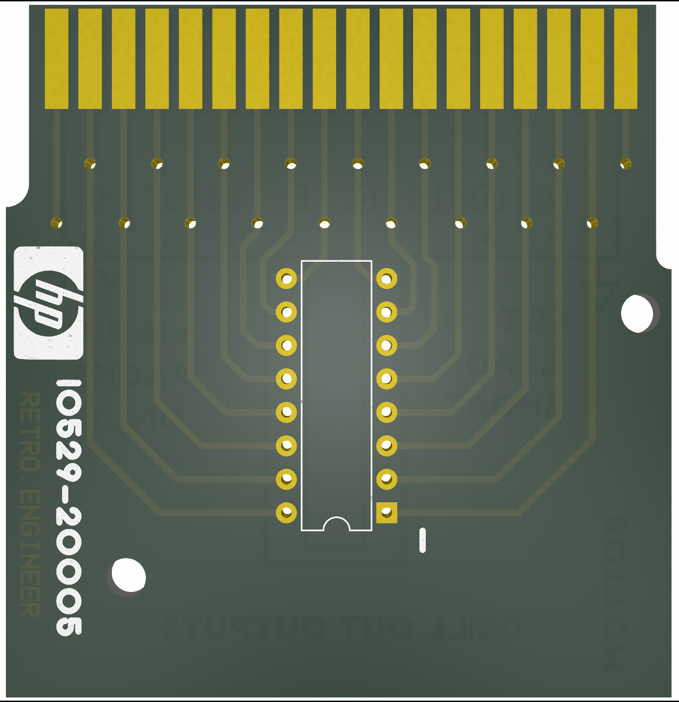
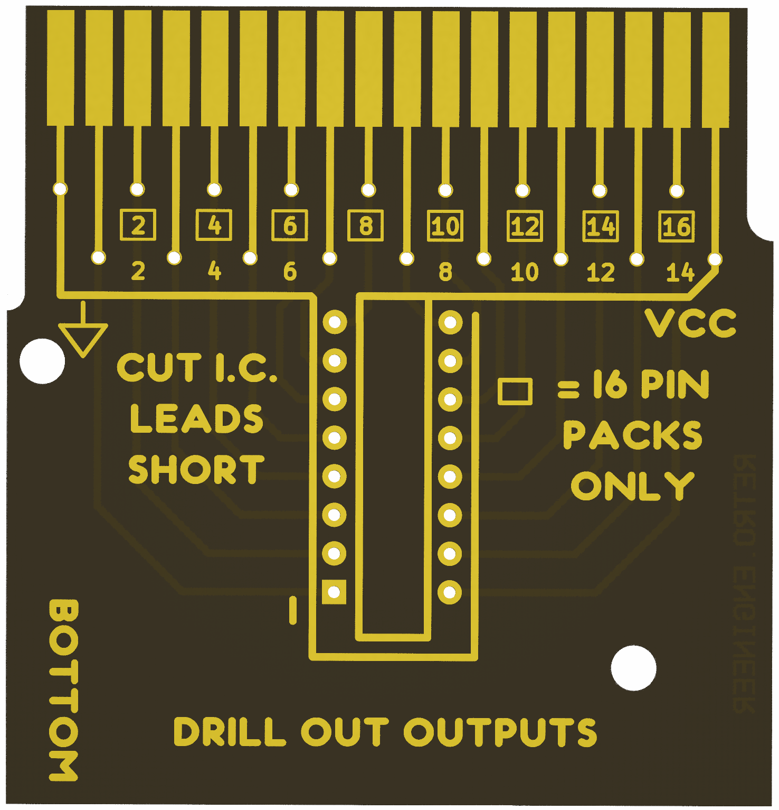

# HP 10529A reference card
This is a KiCAD project and Gerber files for HP 10529-20005 Logic reference IC cards, for the HP 10529A Logic Comparator.

Download the [Gerbers](Gerbers/HP%2010529-20005%20reference%20card%20garbers.zip) here.

Front:

Back:

Original scan front:

Original scan back:

